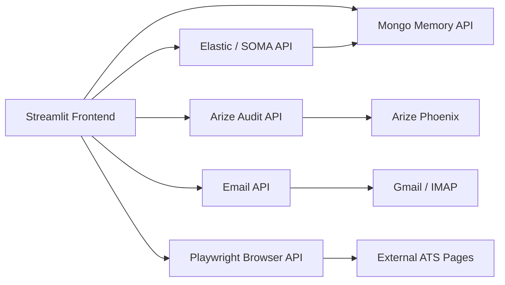

# Job Hunter Agent

Evidence-based job applications, tailored safely for every role.

## Overview

Job Hunter Agent is a job application cockpit for searching roles, tailoring resumes, auditing application quality, discovering external ATS forms, and preserving a memory of each application.

The project is designed around a simple rule:

> Automate repetitive work, but preserve truthfulness, user control, and human confirmation at risky moments.

## Core Features

- LinkedIn job discovery and external apply link extraction.
- Resume tailoring from an original `V0` resume into a job-specific `V1`.
- Per-application resume-to-JD fit scoring.
- PDF generation and readability checks for one-page tailored resumes.
- SOMA retrieval for similar technical-stack application episodes.
- External apply precheck that stops before final submission.
- Structure-first form discovery using DOM, accessibility data, labels, required fields, and locator candidates.
- Vision-assisted fallback for blocked or ambiguous browser states.
- Gmail / IMAP outcome signal ingestion for interview, assessment, reply, rejection, and no-response tracking.
- MongoDB memory for applications, events, artifacts, resume versions, and outcomes.
- Cloud Run deployment scripts for the frontend and backend tool services.

## Architecture



For the audit decision flow, hard blockers, Skill Library trust boundary, and Phoenix
trace behavior, see [Arize / Phoenix Resume Audit Guide](docs/arize_phoenix_audit_guide.md).

## Per-Job Resume Fit

Each application stores its own resume-to-JD score. The system compares the original resume against the tailored resume for that exact job:

$$
\Delta_i = \text{Match}(V_{1,i}, JD_i) - \text{Match}(V_{0,i}, JD_i)
$$

This avoids treating resume improvement as a global metric. A rewrite is only meaningful relative to the specific company, role, and job description.

## Structure-First Apply Agent

The apply agent does not rely on screenshot coordinates as the main control surface. It first creates a structured page state:

- URL
- detected ATS
- form fields
- labels
- required status
- locator candidates
- buttons
- validation errors
- risk levels

Then it builds a preflight plan:

- fields that can be safely autofilled
- fields that need user confirmation
- resume upload availability
- final-submit guard status
- captcha or manual checkpoint detection

The browser loop is:

$$
\text{Observe} \rightarrow \text{Plan} \rightarrow \text{Act} \rightarrow \text{Verify} \rightarrow \text{Stop or Continue}
$$

## Local Setup

1. Install Python dependencies:

```powershell
pip install -r requirements.txt
```

2. Create environment variables from the example:

```powershell
copy .env.example ..\.env.local
```

3. Start the Streamlit frontend:

```powershell
python -m streamlit run frontend/app_frontend.py --server.port=8501 --server.address=0.0.0.0
```

4. Start tool services as needed:

```powershell
python mcp_servers/mongo_server.py
python mcp_servers/elastic_server.py
python mcp_servers/arize_server.py
python mcp_servers/email_server.py
python mcp_servers/playwright_server.py
```

## Cloud Run

The Cloud Run deployment script is:

```powershell
.\cloudrun\deploy_cloud_run.ps1 -ProjectId "YOUR_GCP_PROJECT_ID" -Region "us-central1" -BootstrapSecrets
```

It deploys:

- `jobs-mongo`
- `jobs-elastic`
- `jobs-arize`
- `jobs-email`
- `jobs-playwright`
- `jobs-frontend`

## Safety Principles

- Do not fabricate resume claims.
- Do not guess legal, visa, sponsorship, disability, veteran, or certification answers.
- Do not bypass captchas or human checkpoints.
- Do not submit applications without an explicit final confirmation gate.
- Keep local secrets, browser profiles, screenshots, and generated PDFs out of git.

## License

MIT License. See [`../LICENSE`](../LICENSE).
