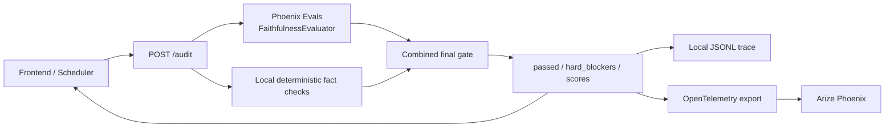

# Arize / Phoenix 简历审查指南

这份文档解释本项目中的 `mcp_servers/arize_server.py`。重点不是 Arize 产品介绍，
而是这套代码如何决定一份微调简历能否继续进入申请流程。

## 1. 先区分四个组件

| 组件 | 在本项目中的职责 | 能否最终放行 |
|---|---|---|
| Arize Audit API | 接收 V0、V1、JD 和 Skill Library，编排审查 | 是 |
| Phoenix Evals FaithfulnessEvaluator | 使用 Gemini Judge 理解 V0/V1 的语义支持关系 | 是，语义权威 |
| Deterministic fact gate | 比较数字、技能、实体和技能位置 | 是，硬事实权威 |
| Phoenix tracing + annotations | 接收 OpenTelemetry trace，并把 Judge Score 登记为 LLM Evaluation | 否，只观察最终结果 |

最重要的结论：

> Phoenix Evals 负责语义 Judge，本地 gate 负责不可由 LLM 覆盖的硬事实；两者都通过才放行。

## 2. 完整数据流



执行顺序对应 `audit_resume()`：

1. 检查 V0、V1 是否存在。
2. 同步运行 `phoenix_evals_audit()`，由 Phoenix FaithfulnessEvaluator 返回 Score。
3. Judge 缺失、无 API key、超时或报错时直接生成 `phoenix_judge_unavailable` blocker。
4. 无论 Judge 结论如何，都必须运行 `apply_trusted_skill_gate()` 检查硬事实。
5. 门禁完成后才规范化分数并构造 trace。
6. 把完整 Judge Score 和 blocker 导出到 Phoenix，并把原生 Score 作为 LLM span annotation 登记。
7. 无论 Phoenix trace collector 是否配置，都会把结果写入本地 JSONL。
8. 把最终审计结果返回调用方。

## 3. 输入数据

`AuditRequest` 的关键字段：

| 字段 | 含义 | 信任级别 |
|---|---|---|
| `resume_v0` | 原始简历 | 主要事实来源 |
| `resume_v1` | 根据 JD 微调后的简历 | 待审查内容 |
| `job_description` | 目标岗位描述 | 只能用于匹配，不能证明候选人经历 |
| `trusted_skills` | 用户确认的 Skill Library | 只证明拥有技能，不证明使用经历 |
| `company` / `role` / `app_id` | trace 关联信息 | 不参与事实证明 |
| `metadata` | 调用方附加信息 | 原样进入 trace，不自动脱敏 |

Skill Library 的边界非常重要：

- V0 已经证明的技能可以继续用于对应经历。
- 只有 Skill Library 证明、V0 没有经历证据的技能，只能放在 Skills 区。
- Library-only 技能写进公司经历、项目、年限、指标或成就时必须阻塞。
- JD 中出现但 V0 和 Skill Library 都没有的技能，不会自动变成可信技能。

## 4. 确定性检查

`heuristic_audit()` 不再判断改写“意思是否相同”。它只检查可确定比较的事实类别：

| `hard_blocker` | 含义 | 示例 |
|---|---|---|
| `unsupported_numbers` | V1 新增了 V0 没有的数字 | `improved throughput by 40%` |
| `untrusted_new_skills` | V1 新增了未经证明的工具或技能 | V0 没有 Kubernetes，V1 新增 Kubernetes |
| `unsupported_entities` | V1 新增了学校、公司、学历或其他实体 | `Stanford University` |
| `misplaced_trusted_skills` | Library-only 技能被写进经历 | 只确认 FastAPI，却写成曾用 FastAPI 交付项目 |
| `phoenix_faithfulness_failed` | Phoenix Judge 判定 V1 不受 V0 证据支持 | 凭空增加职责或成就 |
| `phoenix_judge_unavailable` | Phoenix Judge 没有产生 Score | SDK、密钥或模型调用不可用 |
| `evaluator_reported_hallucination` | Judge 已报告幻觉，却同时返回通过 | `hallucinated_points` 非空且 `passed=true` |

这些 blocker 不能互相抵消，也不能被高 JD 匹配分抵消。

简化后的放行逻辑是：

```text
passed =
    phoenix_faithfulness_score.label == "faithful"
    AND deterministic_fact_checks_passed
    AND hard_blockers is empty
```

只要出现 hard blocker：

- `passed = false`
- `recommended_action = revise_before_apply`，Judge 不可用时为 `retry_audit`
- `faithfulness_score` 最高只能是 `0.82`

因此 `Stanford University` 即使只造成很小的相似度变化，也不能再得到
`passed=true`。

## 5. 三个分数分别代表什么

### `faithfulness_score`

V1 对 V0 的事实忠实度。它用于展示和排序，但不是唯一门禁条件。

### `jd_match_score`

V1 对 JD 关键词的覆盖程度。这个分数高只能说明“更像目标岗位”，不能证明内容真实。

### `risk_score`

当前实现大体是 `1 - faithfulness_score`，用于界面和 trace 展示。

不要使用以下错误逻辑：

```text
JD match 很高，所以可以忽略 hallucination
```

## 6. Phoenix Evals 与本地门禁的关系

`phoenix_evals_audit()` 使用 Phoenix 官方 `FaithfulnessEvaluator`。输入映射为：

```text
input   = 审查任务说明
output  = 微调简历 V1
context = 原始简历 V0 + 用户确认 Skill Library 的有限信任说明
```

Phoenix Score 包含 `label`、`score`、`explanation`、`kind`、`direction` 和
`metadata`。只有 `label=faithful` 才可能继续。

本地门禁不会再因为 `Led` 改写成 `Spearheaded` 就自动阻塞；这种语义关系交给
FaithfulnessEvaluator。但是新增 `40%`、`Stanford University` 或把 Library-only
技能写进经历，仍由本地规则直接阻塞。

没有 Phoenix Evals SDK 或 Gemini API key 时不会回退到文字匹配，而是 fail closed。

## 7. Phoenix 到底记录什么

`build_trace()` 构造审计关联信息：

- `trace_id`
- `app_id`、company、role、apply URL
- evaluator 名称、版本和模型
- faithfulness、JD match、risk
- passed 和 recommended action
- Phoenix 原生 Score 和 explanation
- 所有 hard blockers、unsupported entities/claims、技能位置问题
- 输入长度
- 输入内容的短 SHA-256 hash
- 调用方 metadata

审计 trace 不直接写入原始 V0/V1 文本，但 `metadata` 不会自动脱敏。
调用方不应把密码、验证码、邮箱正文或其他秘密放入 metadata。

`export_trace_to_phoenix()` 使用 OTLP/HTTP 发送一个 `EVALUATOR` span，然后通过
`arize-phoenix-client` 把 Judge 的 `label`、`score`、`explanation` 作为
`annotator_kind=LLM` 的 span annotation 写入。这样该结果会出现在 Phoenix 的
Evaluation/Annotation 视图，而不只是普通 trace 属性。
`export_retriever_trace_to_phoenix()` 发送 SOMA 的 `RETRIEVER` span。

Phoenix 导出失败不会改变 `passed`。原因是可观测性故障不应篡改已经完成的事实判断。
导出结果会出现在响应的 `phoenix_export` 字段中。

## 8. 本地 trace

默认路径：

```text
data/arize_audit_traces.jsonl
```

每行是一个独立 JSON 对象，可能是：

- 简历审计 trace
- SOMA retriever trace

相关接口：

| 接口 | 用途 |
|---|---|
| `GET /health` | 分别检查 Phoenix Judge、trace collector 和 OTLP 依赖 |
| `POST /audit` | 执行简历事实审计 |
| `POST /trace-retriever` | 记录 SOMA 检索过程 |
| `GET /traces` | 查看本地 trace |
| `GET /summary` | 查看通过率和平均分 |

## 9. 下游如何使用结果

Arize API 只返回决定，真正停止工作流的是调用方：

- 手动审核流程在 `passed=false` 时进入 `Pending Arbitration`。
- Scheduler 在审计未通过时进入 `Pending Arbitration`。
- 最终投递前流程在服务不可用或 `passed=false` 时停止，不会继续启动 Playwright。
- 早期岗位入队允许在审计服务暂时不可用时先保存队列记录；最终投递前会再次审计。

因此要审查完整安全性，不能只看 `arize_server.py`，还要检查调用方是否严格处理：

```python
if audit_error:
    stop()
if not audit_result["passed"]:
    stop_and_request_review()
```

## 10. 配置项

| 环境变量 | 用途 |
|---|---|
| `GEMINI_API_KEY` / `GOOGLE_API_KEY` | 给 Phoenix Evals 的 Gemini Judge 使用 |
| `ARIZE_AUDIT_MODEL` | 指定 evaluator 模型 |
| `PHOENIX_BASE_URL` | Phoenix Client 地址；省略时从 collector endpoint 去掉 `/v1/traces` 推导 |
| `PHOENIX_COLLECTOR_ENDPOINT` | Phoenix OTLP collector 地址 |
| `PHOENIX_API_KEY` | Phoenix 鉴权 |
| `PHOENIX_PROJECT_NAME` | Phoenix 项目名 |
| `ARIZE_SERVER_PORT` | 本地服务端口，默认 8003 |

`ARIZE_URL` 是调用方连接这个 Audit API 的地址，不是 Phoenix 网页地址。

## 11. 审查清单

1. `/health` 是否显示 `phoenix_judge_configured=true`。
2. V0=V1 时 Phoenix Score 是否为 `faithful`。
3. 新增学校、公司、数字、工具或职责时是否返回 `passed=false`。
4. `hallucinated_points` 非空时是否绝不返回 `passed=true`。
5. Library-only 技能是否只允许出现在 Skills 区。
6. Phoenix Judge 不可用时是否返回 `phoenix_judge_unavailable` 并阻塞。
7. Phoenix Evaluation 是否以 `annotator_kind=LLM` 绑定到对应 span。
8. Phoenix trace collector 不可用时，本地 JSONL 是否仍有 trace。
9. 最终投递调用方是否在 audit error 和 `passed=false` 时停止。
10. metadata 是否避免包含密码、验证码或其他敏感信息。

## 12. 当前需要继续关注的接口一致性

- OpenAPI 已声明 `trusted_skills`、Phoenix Score 和所有 hard blocker 字段。
- 本地 JSONL、Phoenix span 和 Phoenix Evaluation annotation 保存审计分类；原始 V0/V1 仍不写入 trace。
- 实体识别是确定性正则，不是完整 NER。疑似误报会进入人工仲裁，不应自动绕过。
