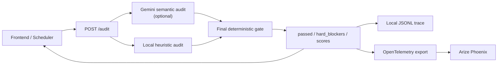

# Arize / Phoenix 简历审查指南

这份文档解释本项目中的 `mcp_servers/arize_server.py`。重点不是 Arize 产品介绍，
而是这套代码如何决定一份微调简历能否继续进入申请流程。

## 1. 先区分四个组件

| 组件 | 在本项目中的职责 | 能否最终放行 |
|---|---|---|
| Arize Audit API | 接收 V0、V1、JD 和 Skill Library，生成审计结果 | 是 |
| Gemini evaluator | 理解语义，给出候选审计结果 | 否，必须再经过本地门禁 |
| Deterministic heuristic | 比较数字、技能、实体、声明和技能位置 | 是，最终安全权威 |
| Arize Phoenix | 接收 OpenTelemetry trace，提供查询和可视化 | 否，只记录和展示 |

最重要的结论：

> Phoenix 不是阻塞器。`apply_trusted_skill_gate()` 才是最终阻塞器。

## 2. 完整数据流



执行顺序对应 `audit_resume()`：

1. 检查 V0、V1 是否存在。
2. 有 Gemini 配置时运行 `llm_audit()`；否则直接运行 `heuristic_audit()`。
3. 无论上一步是谁执行，都必须运行 `apply_trusted_skill_gate()`。
4. 门禁完成后才规范化分数并构造 trace。
5. 尝试把 trace 导出到 Phoenix。
6. 无论 Phoenix 是否配置，都会把结果写入本地 JSONL。
7. 把最终审计结果返回调用方。

## 3. 输入数据

`AuditRequest` 的关键字段：

| 字段 | 含义 | 信任级别 |
|---|---|---|
| `resume_v0` | 原始简历 | 主要事实来源 |
| `resume_v1` | 根据 JD 微调后的简历 | 待审查内容 |
| `job_description` | 目标岗位描述 | 只能用于匹配，不能证明候选人经历 |
| `trusted_skills` | 用户确认的 Skill Library | 只证明拥有技能，不证明使用经历 |
| `company` / `role` / `app_id` | trace 关联信息 | 不参与事实证明 |
| `metadata` | 调用方附加信息 | 原样进入 trace，不自动脱敏 |

Skill Library 的边界非常重要：

- V0 已经证明的技能可以继续用于对应经历。
- 只有 Skill Library 证明、V0 没有经历证据的技能，只能放在 Skills 区。
- Library-only 技能写进公司经历、项目、年限、指标或成就时必须阻塞。
- JD 中出现但 V0 和 Skill Library 都没有的技能，不会自动变成可信技能。

## 4. 确定性检查

`heuristic_audit()` 先规范化 V0、V1 和 Skill Library，然后检查以下类别：

| `hard_blocker` | 含义 | 示例 |
|---|---|---|
| `unsupported_numbers` | V1 新增了 V0 没有的数字 | `improved throughput by 40%` |
| `untrusted_new_skills` | V1 新增了未经证明的工具或技能 | V0 没有 Kubernetes，V1 新增 Kubernetes |
| `unsupported_entities` | V1 新增了学校、公司、学历或其他实体 | `Stanford University` |
| `unsupported_claims` | V1 新增高风险职责或成就声明 | V0 没有 `architected`，V1 声称 architected |
| `misplaced_trusted_skills` | Library-only 技能被写进经历 | 只确认 FastAPI，却写成曾用 FastAPI 交付项目 |
| `evaluator_reported_hallucination` | evaluator 已报告幻觉，却同时返回通过 | `hallucinated_points` 非空且 `passed=true` |

这些 blocker 不能互相抵消，也不能被高 JD 匹配分抵消。

简化后的放行逻辑是：

```text
passed =
    candidate_evaluator_passed
    AND deterministic_evaluator_passed
    AND hard_blockers is empty
```

只要出现 hard blocker：

- `passed = false`
- `recommended_action = revise_before_apply`
- `faithfulness_score` 最高只能是 `0.82`

因此 `Stanford University` 即使只造成很小的相似度变化，也不能再得到
`passed=true`。

## 5. 三个分数分别代表什么

### `faithfulness_score`

V1 对 V0 的事实忠实度。它用于展示和排序，但不是唯一门禁条件。

### `jd_match_score`

V1 对 JD 关键词的覆盖程度。这个分数高只能说明“更像目标岗位”，不能证明内容真实。

### `risk_score`

当前实现大体是 `1 - faithfulness_score`，用于界面和 trace 展示。

不要使用以下错误逻辑：

```text
JD match 很高，所以可以忽略 hallucination
```

## 6. Gemini 与本地门禁的关系

`llm_audit()` 擅长理解语义，例如一句话是否暗示了新增职责。它可能出现两类问题：

- 漏掉一个新增事实。
- 明明列出了 hallucination，却错误返回 `passed=true`。

所以 Gemini 只提供候选结果。`apply_trusted_skill_gate()` 会重新运行
`heuristic_audit()`，合并双方证据，并让任何已报告的 hallucination 强制阻塞。

没有 Gemini API key 时，服务仍然可用，只是候选 evaluator 直接使用本地 heuristic。

## 7. Phoenix 到底记录什么

`build_trace()` 构造审计关联信息：

- `trace_id`
- `app_id`、company、role、apply URL
- evaluator 名称、版本和模型
- faithfulness、JD match、risk
- passed 和 recommended action
- 输入长度
- 输入内容的短 SHA-256 hash
- 调用方 metadata

审计 trace 不直接写入原始 V0/V1 文本，但 `metadata` 不会自动脱敏。
调用方不应把密码、验证码、邮箱正文或其他秘密放入 metadata。

`export_trace_to_phoenix()` 使用 OTLP/HTTP 发送一个 `EVALUATOR` span。
`export_retriever_trace_to_phoenix()` 发送 SOMA 的 `RETRIEVER` span。

Phoenix 导出失败不会改变 `passed`。原因是可观测性故障不应篡改已经完成的事实判断。
导出结果会出现在响应的 `phoenix_export` 字段中。

## 8. 本地 trace

默认路径：

```text
data/arize_audit_traces.jsonl
```

每行是一个独立 JSON 对象，可能是：

- 简历审计 trace
- SOMA retriever trace

相关接口：

| 接口 | 用途 |
|---|---|
| `GET /health` | 检查 Gemini、Phoenix 和 OTLP 依赖配置 |
| `POST /audit` | 执行简历事实审计 |
| `POST /trace-retriever` | 记录 SOMA 检索过程 |
| `GET /traces` | 查看本地 trace |
| `GET /summary` | 查看通过率和平均分 |

## 9. 下游如何使用结果

Arize API 只返回决定，真正停止工作流的是调用方：

- 手动审核流程在 `passed=false` 时进入 `Pending Arbitration`。
- Scheduler 在审计未通过时进入 `Pending Arbitration`。
- 最终投递前流程在服务不可用或 `passed=false` 时停止，不会继续启动 Playwright。
- 早期岗位入队允许在审计服务暂时不可用时先保存队列记录；最终投递前会再次审计。

因此要审查完整安全性，不能只看 `arize_server.py`，还要检查调用方是否严格处理：

```python
if audit_error:
    stop()
if not audit_result["passed"]:
    stop_and_request_review()
```

## 10. 配置项

| 环境变量 | 用途 |
|---|---|
| `GEMINI_API_KEY` / `GOOGLE_API_KEY` | 启用 Gemini evaluator |
| `ARIZE_AUDIT_MODEL` | 指定 evaluator 模型 |
| `PHOENIX_COLLECTOR_ENDPOINT` | Phoenix OTLP collector 地址 |
| `PHOENIX_API_KEY` | Phoenix 鉴权 |
| `PHOENIX_PROJECT_NAME` | Phoenix 项目名 |
| `ARIZE_SERVER_PORT` | 本地服务端口，默认 8003 |

`ARIZE_URL` 是调用方连接这个 Audit API 的地址，不是 Phoenix 网页地址。

## 11. 审查清单

1. `/health` 是否显示预期的 Gemini 和 Phoenix 状态。
2. V0=V1 时是否能通过。
3. 新增学校、公司、数字、工具或职责时是否返回 `passed=false`。
4. `hallucinated_points` 非空时是否绝不返回 `passed=true`。
5. Library-only 技能是否只允许出现在 Skills 区。
6. Phoenix 不可用时，本地 JSONL 是否仍有 trace。
7. 最终投递调用方是否在 audit error 和 `passed=false` 时停止。
8. metadata 是否避免包含密码、验证码或其他敏感信息。

## 12. 当前需要继续关注的接口一致性

- `AuditRequest` 已支持 `trusted_skills`，但 OpenAPI 文件仍需要与运行时模型持续保持一致。
- 本地 JSONL 保存完整审计结果；Phoenix span 只导出选择后的属性，因此审查时两边都要看。
- 实体识别是确定性正则，不是完整 NER。疑似误报会进入人工仲裁，不应自动绕过。
