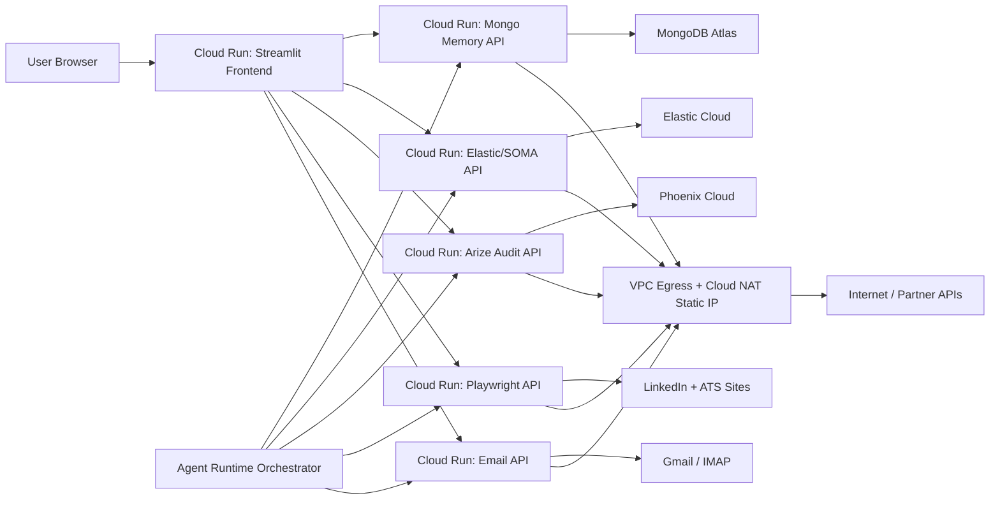
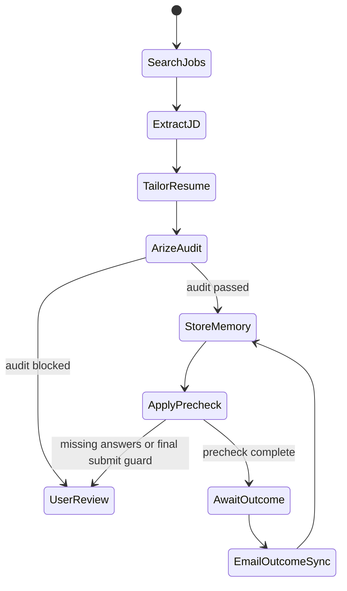

# Google Cloud Phase 4/5 Deployment Plan

## Objective

Move the job-hunting agent from a local desktop stack into Google Cloud without losing the current working behavior:

- LinkedIn search and JD extraction
- MongoDB Atlas long-term memory
- Elasticsearch/SOMA retrieval
- Arize Phoenix tracing and resume audit
- Gmail/email signal ingestion
- Playwright external apply precheck
- Streamlit control UI on port 8501

The immediate production issue is MongoDB Atlas IP allowlisting. Local IPs change, so the cloud deployment must use a stable outbound IP before Atlas can reliably accept connections.

## Current Local Stack

| Component | Local port | Current file | Purpose | Cloud target |
| --- | ---: | --- | --- | --- |
| Mongo memory API | 8001 | `mcp_servers/mongo_server.py` | Application memory, events, artifacts, resume versions | Cloud Run service |
| Elastic/SOMA API | 8002 | `mcp_servers/elastic_server.py` | Job search, episode retrieval, SOMA scoring | Cloud Run service |
| Arize audit API | 8003 | `mcp_servers/arize_server.py` | Resume faithfulness audit, Phoenix trace export | Cloud Run service |
| Playwright API | 8004 | `mcp_servers/playwright_server.py` | Browser automation, LinkedIn search, external apply precheck | Cloud Run service with higher memory/CPU |
| Email API | 8005 | `mcp_servers/email_server.py` | Gmail/IMAP sync and application outcome signals | Cloud Run service or Cloud Run Job |
| Frontend | 8501 | `frontend/app_frontend.py` | Human UI and agent cockpit | Cloud Run service |

## Key Cloud Products

### Phase 4: Reasoning, State, Logic Hosting

1. **Agent Runtime**
   - Use Agent Runtime for the top-level orchestrator, not for every tool server.
   - The orchestrator should be a thin Python agent that decides the next workflow step and calls Cloud Run tools over HTTPS.
   - Framework choice: ADK first if we want Google-native deployment; LangGraph/LangChain if we want explicit state graph control.
   - Candidate orchestrator tools:
     - `search_jobs`
     - `extract_jd`
     - `tailor_resume`
     - `audit_resume`
     - `retrieve_memory`
     - `precheck_apply_form`
     - `sync_email_outcomes`
   - Keep Playwright and Streamlit outside Agent Runtime because they are custom server/browser workloads.

2. **Secret Manager**
   - Store all partner credentials and API keys as secrets.
   - No `.env` files in deployed containers.
   - Minimum secrets:
     - `MONGO_URI`
     - `GEMINI_API_KEY`
     - `PHOENIX_API_KEY`
     - `PHOENIX_COLLECTOR_ENDPOINT`
     - `ELASTIC_URL`
     - `ELASTIC_API_KEY`
     - `EMAIL_IMAP_SERVER`
     - `EMAIL_USERNAME`
     - `EMAIL_PASSWORD`
     - `LINKEDIN_USERNAME`
     - `LINKEDIN_PASSWORD`
   - Give each Cloud Run service account only `roles/secretmanager.secretAccessor` for the secrets it needs.

3. **State**
   - MongoDB Atlas remains the source of truth for long-term memory.
   - Elasticsearch remains the hybrid/vector retrieval index.
   - Phoenix remains the observability/audit trace sink.
   - Local SQLite fallback should stay disabled when `MONGO_URI` is configured.

### Phase 5: Deployment and Safety

1. **Cloud Run for custom backends**
   - Deploy each API server as a separate Cloud Run service first.
   - Only expose the frontend publicly.
   - Backend services should require IAM auth or be ingress-restricted where possible.
   - The frontend calls backend service URLs from env vars:
     - `MONGO_URL`
     - `ELASTIC_URL_API`
     - `ARIZE_URL`
     - `PLAYWRIGHT_URL`
     - `EMAIL_URL`

2. **Static outbound IP**
   - Cloud Run uses dynamic outbound IPs by default.
   - Because MongoDB Atlas uses an IP access list, Cloud Run must use static outbound IP.
   - Preferred setup:
     - Create VPC.
     - Reserve regional static external IP.
     - Create Cloud Router.
     - Create Cloud NAT in manual IP mode using the reserved IP.
     - Configure Cloud Run VPC egress through that VPC/NAT.
     - Add the reserved NAT IP to MongoDB Atlas Network Access.
   - Hackathon shortcut:
     - Use one Compute Engine VM with a static external IP and Docker Compose.
     - Add the VM static IP to Atlas.
     - This is faster but less cloud-native.

3. **Agent Builder / Agent deployment**
   - After Cloud Run services are stable, create the managed orchestrator agent.
   - The deployed agent should expose either:
     - API endpoint for programmatic tasks, or
     - Gemini Enterprise web UI access for demo.
   - The orchestrator should never directly perform irreversible actions. It should call the existing precheck endpoints and stop at final submit guards.

4. **Safety and guardrails**
   - Keep hard product guardrails in code:
     - Never click final submit without explicit user approval.
     - High-risk fields require user-confirmed answers.
     - Account/password records are stored only through approved encrypted storage or Secret Manager.
     - No fake placeholder values on real ATS sites.
   - Configure Gemini safety/content filters for model calls.
   - Add system instructions for safety:
     - "Do not fabricate qualifications."
     - "Do not submit applications without explicit user approval."
     - "Do not answer legal, demographic, sponsorship, or salary questions unless the user provided an answer."
   - Later: evaluate Model Armor / Agent Platform safety governance for prompt injection and sensitive data leakage.

## Recommended Architecture



## Deployment Path

### Option A: Fast Hackathon Path, GCE + Docker Compose

Use this if the priority is demo reliability this week.

1. Create a GCE VM in `us-central1`.
2. Reserve and attach a static external IP.
3. Add that static IP to MongoDB Atlas Network Access.
4. Install Docker and Docker Compose.
5. Copy repo to VM.
6. Create `.env` from secrets manually or from Secret Manager.
7. Run:

```bash
docker compose up -d --build
```

8. Firewall:
   - Allow inbound `8501` only from trusted IPs.
   - Do not expose `8001-8005` publicly unless needed for debugging.

Pros:
- Fastest.
- Keeps existing `docker-compose.yml`.
- Static IP is simple.
- Playwright is easier than on serverless.

Cons:
- You manage VM patching, uptime, and firewall.
- Less aligned with "Cloud Run quickstart" track.

### Option B: Cloud Run Services + Static Egress

Use this for the polished Google Cloud architecture.

1. Enable APIs:

```bash
gcloud services enable \
  run.googleapis.com \
  cloudbuild.googleapis.com \
  artifactregistry.googleapis.com \
  secretmanager.googleapis.com \
  compute.googleapis.com \
  vpcaccess.googleapis.com
```

2. Create secrets:

```bash
printf "%s" "$MONGO_URI" | gcloud secrets create MONGO_URI --data-file=-
printf "%s" "$GEMINI_API_KEY" | gcloud secrets create GEMINI_API_KEY --data-file=-
printf "%s" "$ELASTIC_API_KEY" | gcloud secrets create ELASTIC_API_KEY --data-file=-
```

3. Configure static egress:

```bash
REGION=us-central1
NETWORK=job-agent-vpc
ROUTER=job-agent-router
NAT=job-agent-nat
NAT_IP=job-agent-nat-ip

gcloud compute networks create $NETWORK --subnet-mode=auto
gcloud compute addresses create $NAT_IP --region=$REGION
gcloud compute routers create $ROUTER --network=$NETWORK --region=$REGION
gcloud compute routers nats create $NAT \
  --router=$ROUTER \
  --region=$REGION \
  --nat-all-subnet-ip-ranges \
  --nat-external-ip-pool=$NAT_IP
gcloud compute addresses describe $NAT_IP --region=$REGION --format='value(address)'
```

4. Add the printed NAT IP to MongoDB Atlas Network Access.

5. Update code for Cloud Run:
   - Each service must listen on `PORT` first, then fallback to its current local port.
   - Example:

```python
port = int(os.getenv("PORT") or os.getenv("MONGO_SERVER_PORT", 8001))
```

6. Deploy backend services:

```bash
gcloud run deploy job-mongo-memory \
  --source . \
  --region=$REGION \
  --no-allow-unauthenticated \
  --set-secrets MONGO_URI=MONGO_URI:latest \
  --set-env-vars MONGO_DB_NAME=jobs_hunter \
  --network=$NETWORK \
  --vpc-egress=all-traffic
```

Repeat for:
- `job-elastic`
- `job-arize`
- `job-playwright`
- `job-email`
- `job-frontend`

7. Frontend service gets backend URLs:

```bash
gcloud run services update job-frontend \
  --region=$REGION \
  --set-env-vars \
MONGO_URL=https://job-mongo-memory-...run.app,\
ELASTIC_URL_API=https://job-elastic-...run.app,\
ARIZE_URL=https://job-arize-...run.app,\
PLAYWRIGHT_URL=https://job-playwright-...run.app,\
EMAIL_URL=https://job-email-...run.app
```

8. Auth:
   - Public access only for frontend during demo.
   - Backend services should require Cloud Run IAM invocation.
   - Frontend service account gets `roles/run.invoker` on backend services.

## Required Code Changes Before Cloud Run

1. **Port contract**
   - Update all server files to use `PORT`:
     - `mongo_server.py`
     - `elastic_server.py`
     - `arize_server.py`
     - `playwright_server.py`
     - `email_server.py`
   - Streamlit command should use `${PORT:-8501}` in deployment.

2. **Secrets**
   - Remove reliance on local `.env` in cloud.
   - Keep `.env` only for local dev.
   - Add a `docs/secrets_inventory.md` or table in this file.

3. **Cloud-safe storage**
   - Screenshots and generated PDFs should move from local disk to Cloud Storage.
   - Short-term local disk is acceptable for one request, but not for durable storage.

4. **Playwright**
   - Ensure headless mode.
   - Persistent LinkedIn profile will not work the same way in Cloud Run unless backed by a volume-like external store.
   - Prefer cookie injection from Secret Manager or a controlled re-login flow.

5. **Gmail OAuth**
   - Current redirect uses `http://localhost:8501`.
   - Add Cloud Run frontend URL as an authorized redirect URI in Google Cloud Console.

6. **MongoDB**
   - Keep SQLite fallback disabled when `MONGO_URI` exists.
   - Health should fail loudly if Atlas is unavailable.
   - Verify Atlas allowlist uses the GCP static egress IP.

## Agent Runtime Plan

### First managed agent

Name: `job_hunter_orchestrator`

Responsibilities:
- Decide which pipeline step to execute.
- Call existing tool servers.
- Maintain high-level state.
- Return concise status to the user.

It should not:
- Run Playwright directly.
- Store secrets.
- Click final submit.
- Invent missing user profile answers.

### Suggested action graph



## Safety Plan

### Hard stops

- Final submit button visible.
- Captcha or bot challenge.
- Visa/work authorization/sponsorship question without preset answer.
- EEO, disability, veteran, race, gender fields without explicit user choice.
- Salary expectation without user-provided range.
- Terms/privacy acceptance unless user explicitly allows.

### Audit gates

- Resume PDF must be exactly one page.
- PDF must be visually readable.
- Arize/Gemini audit must pass faithfulness threshold.
- MongoDB write must succeed before application state moves forward.

### Logging

- Every agent action should log:
  - application id
  - current URL
  - action type
  - model decision if used
  - screenshot path or Cloud Storage object
  - stop reason
  - trace id

## Milestones

### Milestone 1: Cloud-ready local code

- Add `PORT` support to all services.
- Add Secret Manager variable names to deployment docs.
- Confirm local Docker Compose still works.
- Confirm `MONGO_URI` required mode does not fallback to SQLite.

### Milestone 2: GCE demo deployment

- VM with static IP.
- Docker Compose running.
- Atlas allowlist fixed.
- 8501 accessible.
- Run one LinkedIn search and one external apply precheck.

### Milestone 3: Cloud Run backend deployment

- Deploy 8001-8005 as Cloud Run services.
- Configure VPC egress and Cloud NAT static IP.
- Add NAT IP to Atlas.
- Frontend uses Cloud Run service URLs.
- Backend services protected with IAM.

### Milestone 4: Agent Runtime orchestrator

- Build first `job_hunter_orchestrator`.
- It calls Cloud Run tool APIs.
- It can run Search -> JD -> Resume -> Audit -> Precheck.
- It stops for human review at guardrail points.

### Milestone 5: Safety and observability

- Add Gemini safety settings for model calls.
- Add system safety instructions.
- Add Cloud Logging/Trace correlation IDs.
- Connect Phoenix trace IDs back into MongoDB artifacts.

## Open Decisions

- Do we use GCE first for hackathon reliability, then Cloud Run after demo?
- Do we expose only Streamlit, or also expose a public API endpoint?
- Do we migrate screenshots/PDFs to Cloud Storage now or after Cloud Run?
- Do we use ADK, LangGraph, or LangChain for the managed orchestrator?
- Do we need user authentication on 8501 before public demo?

## Official References

- Agent Runtime overview and framework support: https://docs.cloud.google.com/gemini-enterprise-agent-platform/scale
- Agent Runtime quickstart: https://docs.cloud.google.com/gemini-enterprise-agent-platform/build/runtime/quickstart
- Cloud Run Python quickstart: https://docs.cloud.google.com/run/docs/quickstarts/build-and-deploy/deploy-python-service
- Cloud Run LangChain quickstart: https://docs.cloud.google.com/run/docs/quickstarts/build-and-deploy/deploy-python-langchain-service
- Cloud Run ADK quickstart: https://docs.cloud.google.com/run/docs/quickstarts/build-and-deploy/deploy-python-adk-service
- Cloud Run static outbound IP: https://docs.cloud.google.com/run/docs/configuring/static-outbound-ip
- Cloud Run secrets with Secret Manager: https://docs.cloud.google.com/run/docs/configuring/services/secrets
- Cloud Run environment variable guidance: https://docs.cloud.google.com/run/docs/configuring/services/environment-variables
- Cloud Run Compose deployment: https://docs.cloud.google.com/run/docs/deploy-run-compose
- MongoDB Atlas IP access list: https://www.mongodb.com/docs/atlas/security/ip-access-list/
- Gemini Enterprise safety filters: https://docs.cloud.google.com/gemini-enterprise-agent-platform/models/capabilities/configure-safety-filters
- Gemini Enterprise safety overview: https://docs.cloud.google.com/gemini-enterprise-agent-platform/models/safety-overview
- Gemini as safety filter/moderation: https://docs.cloud.google.com/gemini-enterprise-agent-platform/models/capabilities/gemini-for-filtering-and-moderation
- Agent Platform safety governance: https://docs.cloud.google.com/gemini-enterprise-agent-platform/govern/safety
